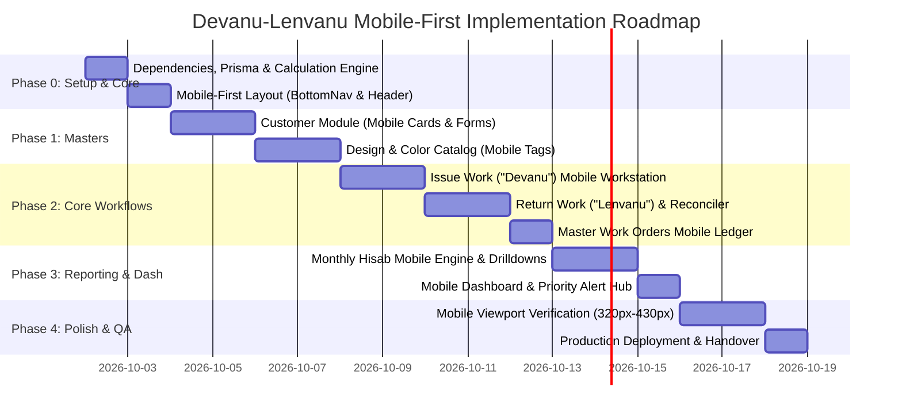

# Devanu-Lenvanu — Mobile-First Implementation Plan & Architecture

> **System Overview**: Internal single-operator web application replacing physical record books to track material/pieces given to workers/customers (*Devanu*) and finished pieces returned (*Lenvanu*), including damage accounting, rate overrides, and monthly settlement reports (*Hisab*).
> 
> **Primary Mandate**: **Mobile-First Design & Usability**. Designed from the ground up for one-handed smartphone use in the workshop/office (320px–430px viewports) with progressive enhancement for tablets (768px+) and desktop (1024px+).

---

## 1. Executive Summary & Core Architectural Principles

### 1.1 Mobile-First Philosophy
- **Smartphones are Tier-1 Target**: The primary user operates the system while standing or moving around in a workshop using an Android phone or iPhone. Mobile phone ergonomics, finger touch targets, and fast thumb access supersede desktop-centric paradigms.
- **Physical Book Replacement**: The system mirrors the natural workflow of Surat textile/cutting job-work record books rather than acting as a bloated ERP.
- **Single Operator / Zero Friction**: No authentication/login overhead in Version 1. High speed, responsive, thumb-friendly data entry.
- **Historical Immutability**: Historical transactions must **never** be mutated or recalculated when master designs or default rates change. Rates and quantities are stored as permanent transaction snapshots.
- **Strict Accounting Invariant**:
  $$\text{Given Pieces} = \text{Returned Pieces} + \text{Damaged/Garbage Pieces} + \text{Remaining Pieces}$$
  $$\text{Returned Pieces} + \text{Damaged Pieces} \le \text{Given Pieces}$$
- **Soft Deletion / Archival**: Customers and Designs with historical transaction data are never hard-deleted from the database; they are archived (`isActive = false`) to preserve audit and report integrity.

---

## 2. Mobile-First UI/UX & Interaction Architecture

### 2.1 Viewport Breakpoints Strategy
```text
Mobile Baseline:  320px (iPhone SE 1st gen), 360px/375px/390px/414px/430px (Standard & Large Phones)
Tablet (md:):     768px+ (iPad / Android Tablet)
Desktop (lg:):    1024px+ / 1280px+ (Laptops & Monitors)
```
- We write Tailwind classes starting from **mobile base styles**, progressively enhancing with `sm:`, `md:`, and `lg:`.
- **Zero Horizontal Window Scrollbars**: No page or dialog will cause horizontal scrolling on viewports as narrow as 320px.

### 2.2 Navigation Architecture
```text
┌────────────────────────────────────────────────────────┐
│ [☰]  Devanu-Lenvanu                      [ + New Work] │ ← Compact Top Header
├────────────────────────────────────────────────────────┤
│                                                        │
│                  Mobile Page Content                   │
│             (Cards, Vertical Forms, KPIs)              │
│                                                        │
├────────────────────────────────────────────────────────┤
│  [🏠 Home]    [👥 Karigar]    [✂️ Work]    [📊 Hisab]  │ ← Fixed Bottom Nav
└────────────────────────────────────────────────────────┘
```
- **Mobile (`< md`)**: Fixed Bottom Navigation Bar for the 4 core sections (`Home`, `Customers`, `Work`, `Reports`) with high thumb-reach ergonomics, plus a slim Top Header with quick-action dispatch `+` and active view title.
- **Desktop / Tablet (`md:`, `lg:`)**: Automatically transforms into a sleek, fixed Left Sidebar layout with expanded table views and secondary action menus.

### 2.3 Touch Ergonomics & Keyboard Optimization
- **Hit Targets**: Minimum **44px × 44px** touch area for all buttons, select boxes, inputs, table action triggers, and badges.
- **No `:hover` Dependencies**: All actions (Return, Edit, Archive, View) are directly accessible via tap or visible action menus without requiring hover triggers.
- **Native Keyboard Mapping**:
  - Worker Phone Numbers: `<input type="tel" inputMode="tel" />`
  - Heads / Pieces Quantities: `<input type="number" inputMode="numeric" pattern="[0-9]*" />`
  - Rates / Prices: `<input type="number" step="0.01" inputMode="decimal" />`
  - Dates: `<input type="date" />` with native calendar sheet
  - Search: `<input type="search" />` with quick-clear `✕` button
- **Sticky Form Action Bar**: Primary submission buttons (`[ Save Work Order ]`, `[ Record Return & Complete ]`) sit in a sticky bottom footer on mobile forms, allowing one-tap submission without scrolling back through long fields.
- **Card-Based Mobile Ledgers**: Multi-column tables convert automatically to rich, high-contrast **Job Cards** on mobile, reserving full multi-column tables for desktop/tablet screens.

---

## 3. Technology Stack & Directory Structure

```
┌────────────────────────────────────────────────────────────────────────┐
│                   Devanu-Lenvanu Web Application                       │
├────────────────────────────────────────────────────────────────────────┤
│  Frontend (Next.js 16 App Router + React 19 + TypeScript)              │
│  ├── Mobile-First Shell: Bottom Nav (< md) + Desktop Sidebar (>= md)   │
│  ├── UI Components: Tailwind CSS v4 + Radix Primitives + Lucide Icons  │
│  ├── Form State & Validation: React Hook Form + Zod schemas            │
│  └── Feedback: Sonner Toast + Touch-friendly Modal/Sheet Dialogs       │
├────────────────────────────────────────────────────────────────────────┤
│  Domain & Calculation Engine (Pure TypeScript Utilities)               │
│  ├── lib/calculations/quantity.ts     (Head × Piece calculations)       │
│  ├── lib/calculations/amount.ts       (Per-piece / Per-head amount)    │
│  ├── lib/calculations/status.ts       (Pending / Partial / Completed)  │
│  └── lib/validations/*                (Zod schemas for all mutations)  │
├────────────────────────────────────────────────────────────────────────┤
│  Database Layer                                                        │
│  ├── Prisma ORM 6.x                                                    │
│  └── PostgreSQL (Neon / Supabase / Local Docker Postgres)              │
└────────────────────────────────────────────────────────────────────────┘
```

### File & Directory Structure
```
leva-devanu/
├── app/
│   ├── layout.tsx                  # Root layout with BottomNav (mobile) & Sidebar (desktop)
│   ├── page.tsx                    # Mobile-first Dashboard & metrics
│   ├── globals.css                 # Tailwind v4 theme, mobile touch tokens
│   │
│   ├── customers/
│   │   ├── page.tsx                # Mobile customer cards + search + desktop table
│   │   ├── new/page.tsx            # Add customer vertical form
│   │   └── [id]/
│   │       ├── page.tsx            # Customer profile, ledger & active jobs
│   │       └── edit/page.tsx       # Edit customer details
│   │
│   ├── designs/
│   │   ├── page.tsx                # Design catalog cards / table
│   │   ├── new/page.tsx            # Add design + dynamic color tags
│   │   └── [id]/
│   │       ├── page.tsx            # Design usage history & colors
│   │       └── edit/page.tsx       # Edit design details
│   │
│   ├── work/
│   │   ├── page.tsx                # Master work orders (Cards on mobile, Table on desktop)
│   │   ├── new/page.tsx            # Fast-entry "Devanu" dispatch workstation
│   │   └── [id]/
│   │       ├── page.tsx            # Transaction inspection detail
│   │       └── return/page.tsx     # Fast-entry "Lenvanu" return & damage reconciler
│   │
│   └── reports/
│       └── monthly/
│           └── page.tsx            # Mobile monthly hisab cards + print sheet
│
├── components/
│   ├── layout/
│   │   ├── BottomNav.tsx           # Mobile fixed bottom navigation bar (< md)
│   │   ├── MobileHeader.tsx        # Mobile top header with fast '+' action
│   │   └── DesktopSidebar.tsx      # Desktop side navigation (>= md)
│   ├── ui/                         # Buttons, Cards, Dialogs, Badges, Inputs (min 44px)
│   ├── dashboard/                  # Stacked mobile KPI cards, pending work list
│   ├── customers/                  # Customer card, customer form, search bar
│   ├── designs/                    # Design card, color tag badges, design form
│   ├── work/                       # Devanu form, Lenvanu return form, job cards
│   └── reports/                    # Month picker, worker hisab card, print view
│
├── lib/
│   ├── prisma.ts                   # Singleton Prisma client instance
│   ├── calculations/
│   │   ├── quantity.ts             # Given & remaining calculations
│   │   ├── amount.ts               # Amount & rate calculations
│   │   └── status.ts               # Status transition logic
│   ├── validations/
│   │   ├── customer.ts             # Zod validation schemas
│   │   ├── design.ts
│   │   ├── transaction.ts
│   │   └── report.ts
│   ├── actions/                    # Next.js Server Actions for CRUD operations
│   │   ├── customer-actions.ts
│   │   ├── design-actions.ts
│   │   ├── transaction-actions.ts
│   │   └── report-actions.ts
│   └── utils.ts                    # Indian currency (₹), date formats, cn helper
│
├── prisma/
│   ├── schema.prisma               # Prisma relational schema
│   └── seed.ts                     # Initial seed data for test designs & sample customers
│
├── docs/
│   ├── devanu-lenvanu-project-specification.md
│   └── implementation-plan.md
│
├── .env.example
├── package.json
├── tsconfig.json
└── README.md
```

---

## 4. Database Schema & Relational Models

```prisma
// prisma/schema.prisma

generator client {
  provider = "prisma-client-js"
}

datasource db {
  provider = "postgresql"
  url      = env("DATABASE_URL")
}

enum MaterialType {
  BHAGVAN_ASSEN_NET  // Bhagvan na assen na net
  WATWAT             // Watwat
}

enum WorkType {
  KATAR_CUTTING      // Katar Cutting
  RENIYA_CUTTING     // Reniya Cutting
}

enum TransactionStatus {
  PENDING            // Material with customer, no return yet
  PARTIALLY_RETURNED // Partial pieces returned, remaining > 0
  COMPLETED          // Returned + Damaged == Given
  CANCELLED          // Voided transaction
}

enum RateUnit {
  PER_PIECE          // Rate applied per completed piece
  PER_HEAD           // Rate applied per completed head
}

model Customer {
  id           String            @id @default(cuid())
  name         String
  phoneNumber  String?
  address      String?
  notes        String?
  isActive     Boolean           @default(true)
  createdAt    DateTime          @default(now())
  updatedAt    DateTime          @updatedAt

  transactions WorkTransaction[]

  @@index([name])
  @@index([phoneNumber])
  @@index([isActive])
}

model Design {
  id             String            @id @default(cuid())
  designNumber   String            @unique
  materialType   MaterialType
  headQuantity   Int?              // Standard heads per lot (optional reference)
  piecesPerHead  Int               // Default pieces per head (e.g. 12)
  defaultRate    Decimal           @db.Decimal(10, 2)
  rateUnit       RateUnit          @default(PER_PIECE)
  notes          String?
  isActive       Boolean           @default(true)
  createdAt      DateTime          @default(now())
  updatedAt      DateTime          @updatedAt

  colors         DesignColor[]
  transactions   WorkTransaction[]

  @@index([designNumber])
  @@index([isActive])
}

model DesignColor {
  id            String            @id @default(cuid())
  designId      String
  colorName     String
  createdAt     DateTime          @default(now())

  design        Design            @relation(fields: [designId], references: [id], onDelete: Cascade)
  transactions  WorkTransaction[]

  @@unique([designId, colorName])
  @@index([designId])
}

model WorkTransaction {
  id               String             @id @default(cuid())
  customerId       String
  designId         String
  colorId          String?

  // Snapshot master fields to preserve historical truth
  materialType     MaterialType
  workType         WorkType
  headQuantity     Int                // Given heads (e.g. 230)
  piecesPerHead    Int                // Given pieces per head (e.g. 12)
  givenPieces      Int                // Computed: headQuantity * piecesPerHead (e.g. 2760)

  // Reconciliation quantities
  returnedPieces   Int                @default(0)
  damagedPieces    Int                @default(0)

  // Rate snapshot
  rate             Decimal            @db.Decimal(10, 2) // Transaction rate (e.g. 0.50)
  rateUnit         RateUnit           @default(PER_PIECE)

  // Dates
  startDate        DateTime           // When material was given
  returnDate       DateTime?          // When return was finalized/recorded

  status           TransactionStatus  @default(PENDING)
  notes            String?

  createdAt        DateTime           @default(now())
  updatedAt        DateTime           @updatedAt

  // Relations
  customer         Customer           @relation(fields: [customerId], references: [id])
  design           Design             @relation(fields: [designId], references: [id])
  color            DesignColor?       @relation(fields: [colorId], references: [id])

  @@index([customerId])
  @@index([designId])
  @@index([colorId])
  @@index([status])
  @@index([startDate])
  @@index([returnDate])
}
```

---

## 5. Detailed Module-by-Module Specifications (Mobile-First)

### Module 1: Dashboard & Analytics Hub (`/`)
- **Mobile View**:
  - Vertical stack of **3 High-Priority KPI Cards**:
    1. 🔴 **Pending Work Outside** (Count + Total Pieces outside, e.g. `12 Orders • 14,200 pcs`)
    2. 🟢 **This Month Hisab** (Total Payable Amount e.g. `₹28,500`)
    3. 🟡 **This Month Damaged / Scrap** (e.g. `45 pcs`)
  - **Quick Action Bar**: Prominent `[ + Issue Work (Devanu) ]` button at the top of the dashboard.
  - **Pending Work Cards Stream**: Each pending job displayed as a clean card showing Worker name, Design/Color, Pieces outside, and a direct `[ ⚡ Record Return ]` button.
- **Desktop Enhancement (`md:`, `lg:`)**: Multi-column summary grid, side-by-side recent transaction table.

---

### Module 2: Customer Management (`/customers`)
- **Mobile View**:
  - Prominent search bar with instant filter and clear button.
  - Quick action: Floating or header `+ Add Customer` button.
  - **Customer Card List**:
    ```text
    ┌─────────────────────────────────────────┐
    │ Rajbhai Patel                 [Active]  │
    │ 📞 9876543210 (Tap to call)             │
    │ 📍 Katargam, Surat                      │
    │ Pending Work: 2 jobs (4,200 pcs)        │
    │ [View Profile & Hisab]   [New Order]   │
    └─────────────────────────────────────────┘
    ```
  - Direct `tel:9876543210` link so operator can call worker with one tap.
- **Customer Form (`/customers/new` & `edit`)**:
  - Single vertical column with large inputs, `type="tel"` for phone, and sticky bottom `[ Save Customer ]` action bar.
- **Customer Profile (`/customers/[id]`)**:
  - Summary stats banner (Total Lifetime Orders, Total Pieces Completed, Lifetime Earnings).
  - Tabbed or stacked view: **Active Jobs** (with quick Return action) and **Completed History**.
  - Touch-friendly Archive button with confirmation modal.

---

### Module 3: Design & Color Catalog (`/designs`)
- **Mobile View**:
  - Design cards with clear visual hierarchy:
    ```text
    ┌─────────────────────────────────────────┐
    │ DESIGN-01                               │
    │ Material: Bhagvan na assen na net       │
    │ Lot Specs: 12 pcs/head • Default ₹0.50  │
    │ Colors: [Black] [Red] [Green] [Navy]    │
    │ [Edit Design]            [View Usage]   │
    └─────────────────────────────────────────┘
    ```
- **Design Form (`/designs/new` & `edit`)**:
  - Design Number input (auto-uppercased).
  - Material Type selector (large tap-friendly radio buttons / pills).
  - Pieces per Head (`inputmode="numeric"`).
  - Default Rate (`inputmode="decimal"`).
  - **Interactive Color Variant Manager**: Type color name and tap `[ + Add ]` to create tag badges with one-tap `✕` delete.
  - Sticky `[ Save Design ]` button.

---

### Module 4: Issue Work ("Devanu") Fast-Entry Engine (`/work/new`)
- **Mobile Fast-Entry Workflow**:
  1. **Select Worker / Customer**: Searchable select with recently used workers on top.
  2. **Select Design**: Once chosen, automatically pre-fills:
     - Material Type
     - Pieces per Head
     - Default Rate
     - Filters the **Color selector** to only show colors available for this design.
  3. **Select Color**: Tap-to-select pills or dropdown.
  4. **Select Work Type**: Quick segmented control `[ Katar Cutting ]` | `[ Reniya Cutting ]`.
  5. **Enter Heads**: Large numeric input. Total Given Pieces automatically updates in real-time ($230 \times 12 = 2760\text{ pcs}$).
  6. **Rate**: Pre-filled with design default; operator can tap and edit if customer has a special rate.
  7. **Start Date**: Native date selector (defaults to Today).
  8. **Sticky Bottom Submit**: `[ Issue 2,760 Pieces (₹0.50/pc) ]` button with loading spinner on submit to prevent double entry.

---

### Module 5: Return Work ("Lenvanu") & Damage Reconciler (`/work/[id]/return`)
- **Mobile Reconciliation Screen**:
  - **Order Header Card**:
    ```text
    Rajbhai • DESIGN-01 (Black) • Katar Cutting
    Given: 12,000 pcs (Issued: 02-10-2026)
    ```
  - **Reconciliation Inputs**:
    - **Returned Pieces** (`inputmode="numeric"`): e.g., `11,990`
    - **Damaged / Scrap Pieces** (`inputmode="numeric"`): e.g., `10`
    - **Return Date**: Native date picker (defaults to Today)
    - **Notes**: Optional remarks (e.g., "5 pieces defect in cloth")
  - **Real-Time Live Balancer**:
    ```text
    ┌─────────────────────────────────────────┐
    │ Given Pieces:       12,000              │
    │ Returned (Good):    11,990              │
    │ Damaged (Kharab):       10              │
    │ ─────────────────────────────────────── │
    │ Remaining:               0              │
    │ Status:  ✓ READY TO COMPLETE            │
    └─────────────────────────────────────────┘
    ```
  - **Dynamic Invariant Feedback**:
    - If $\text{Remaining} = 0$: Green banner `✓ Completed — All pieces accounted for`.
    - If $\text{Remaining} > 0$: Amber banner `⏳ Partially Returned — 100 pieces still outside`.
    - If $\text{Returned} + \text{Damaged} > \text{Given}$: Red alert `⚠️ Error: Accounted pieces (12,010) exceed Given pieces (12,000)`. Submit button disabled.
  - **Sticky Action Bar**: `[ Complete & Finalize Return ]` button.

---

### Module 6: Master Work Orders Ledger (`/work`)
- **Mobile View**:
  - **Filter Segment Tabs**: `All` | `Pending` | `Partial` | `Completed` | `Cancelled` (horizontally swipeable on mobile).
  - **Search & Filter Drawer**: Filter by Worker, Design, Material, Date Range.
  - **Work Order Cards**:
    ```text
    ┌─────────────────────────────────────────┐
    │ #WO-104 • 02-10-2026          [PENDING] │
    │ Rajbhai • DESIGN-01 (Black)             │
    │ Katar Cutting • 230 heads × 12 pcs      │
    │                                         │
    │ Given: 2,760 pcs       Rate: ₹0.50/pc   │
    │ Returned: 0            Damaged: 0       │
    │ Outside: 2,760 pcs                      │
    │                                         │
    │ [⚡ Record Return]        [View Details] │
    └─────────────────────────────────────────┘
    ```
- **Desktop Enhancement**: Converts to dense data table with column sorting and bulk actions.

---

### Module 7: Monthly Hisab / Settlement Reports (`/reports/monthly`)
- **Mobile View**:
  - Month & Year selector with rapid `[ < Prev Month ]` `[ Next Month > ]` buttons.
  - Filter by specific Worker or Material type.
  - **Monthly Summary KPIs**:
    - Total Orders Settled
    - Total Pieces Cut
    - Total Damaged Pieces
    - **Grand Total Payable (₹)**
  - **Worker Hisab Cards**:
    ```text
    ┌─────────────────────────────────────────┐
    │ Rajbhai Patel                           │
    │ 5 Completed Orders                      │
    │ Good Pieces: 12,000 pcs                 │
    │ Damaged: 10 pcs                         │
    │ Total Payable: ₹6,000.00                │
    │                                         │
    │ [View Itemized Breakdown (5)]           │
    └─────────────────────────────────────────┘
    ```
  - **Itemized Sheet**: Tap to open a bottom sheet showing every transaction included in this worker's monthly payout.
  - **Export / Print**: Single tap to open a clean, printable settlement statement format.

---

## 6. Implementation Milestones & Work Breakdown



### **Milestone 0: Setup, Database & Mobile Layout Shell**
- Install core dependencies (`prisma`, `@prisma/client`, `zod`, `react-hook-form`, `@hookform/resolvers`, `lucide-react`, `date-fns`, `sonner`, `clsx`, `tailwind-merge`).
- Setup Prisma schema with PostgreSQL models (`Customer`, `Design`, `DesignColor`, `WorkTransaction`) and run migration.
- Implement pure calculation functions in `lib/calculations/` with complete test assertions.
- Build mobile layout primitives:
  - `BottomNav.tsx` (Mobile bottom bar with active highlights and badge counts)
  - `MobileHeader.tsx` (Compact top bar with fast `+` action)
  - `DesktopSidebar.tsx` (Progressive enhancement for tablet/desktop)
  - `ToastProvider` with `sonner` configured for bottom-center mobile toasts.

### **Milestone 1: Customer & Design Masters (Mobile-First)**
- **Customer Module**:
  - Mobile search bar with instant clear.
  - Customer Card List with direct `tel:` dialing and pending work badges.
  - Single-column Add/Edit Customer form with `type="tel"` and sticky save button.
  - Customer profile with active work vs historical completed jobs.
  - Soft-archive modal with confirmation.
- **Design Module**:
  - Design catalog cards with material tags, lot specs, and color pills.
  - Add/Edit Design form with interactive color tag manager.
  - Design profile showing usage history.

### **Milestone 2: Issue Work ("Devanu") Mobile Workstation**
- Build `/work/new` fast-entry form:
  - Worker select $\rightarrow$ Design select $\rightarrow$ Color filtered pills $\rightarrow$ Work Type toggle.
  - Numeric input for Heads with real-time computation of Total Given Pieces.
  - Rate override with visual default comparison.
  - Native date selector defaulting to Today.
  - Sticky submit action with double-submit prevention.

### **Milestone 3: Return Work ("Lenvanu") & Damage Reconciler**
- Build `/work/[id]/return` mobile reconciliation screen:
  - Original order summary card.
  - Large numeric inputs for `Returned Pieces` and `Damaged Pieces`.
  - Live balance counter updating remaining count and transition status.
  - Invariant enforcement: strict validation preventing $\text{Returned} + \text{Damaged} > \text{Given}$.
  - Auto-status transition: `COMPLETED` when $\text{Remaining} = 0$, `PARTIALLY_RETURNED` when $> 0$.

### **Milestone 4: Work Orders Mobile Ledger**
- Build `/work` unified ledger:
  - Swipeable status tabs (`All`, `Pending`, `Partial`, `Completed`, `Cancelled`).
  - Search & filter drawer.
  - High-contrast job cards with direct `[ ⚡ Return ]` and `[ View ]` actions.
  - Progressive enhancement to dense data table on desktop.

### **Milestone 5: Monthly Hisab / Settlement Module**
- Build `/reports/monthly` mobile settlement engine:
  - Month/Year selector with prev/next quick navigation.
  - Aggregated KPI cards (Pieces cut, damaged count, total payable ₹).
  - Worker Hisab cards with total payout and job count.
  - Drilldown modal/sheet showing itemized transaction breakdown.
  - Print-friendly layout for physical slips or PDF generation.

### **Milestone 6: Mobile Dashboard & KPI Hub**
- Build `/` mobile home dashboard:
  - Stacked priority KPI cards (Pending orders, pieces outside, monthly hisab).
  - Fast-action `[ + Issue Work ]` button.
  - Pending jobs list with direct 1-tap return action.
  - Today's summary card (Dispatched vs Returned today).

### **Milestone 7: Mobile QA, Cross-Device Verification & Deployment**
- Comprehensive testing across viewports:
  - Small Android / iPhone SE (320px, 360px, 375px)
  - Standard & Large Phones (390px, 414px, 430px)
  - Tablets (768px+) & Desktop (1024px+)
- Test touch interactions: no double-tap zoom bugs, keyboard overlay issues, or input truncation.
- Verify historical snapshot integrity (changing design rate does not affect past transaction hisab).
- Verify soft-archive behavior (archived workers preserved in historical hisab).
- Production build test (`next build`) and deployment guide.

---

## 7. Mobile-First Verification & Quality Assurance Matrix

| Test ID | Area | Viewport | Action / Input | Expected Result |
|---|---|---|---|---|
| **MOB-01** | Navigation | 360px | Tap Bottom Navigation items | Smooth route change without page reload; bottom nav remains fixed with $\ge 44\text{px}$ touch targets. |
| **MOB-02** | Work Entry | 375px | Open `/work/new`, fill Heads = `230` | Numeric keyboard appears; Given Pieces auto-calculates to `2,760`; Sticky save button easily tappable with thumb. |
| **MOB-03** | Return Balancer | 390px | Open return screen for 1,000 pcs; enter Return = `990`, Damaged = `10` | Balance updates live to `0 Remaining`; status turns green `✓ Ready to Complete`; submit completes order. |
| **MOB-04** | Invalid Return | 360px | Enter Return = `950`, Damaged = `60` ($=1010 > 1000$) | Red error banner displayed; submit button disabled; mutation blocked. |
| **MOB-05** | Viewport 320px | 320px | Inspect Dashboard, Customer Cards, and Forms | Zero horizontal scrolling; all text, badges, and action buttons fit inside 320px viewport without clipping. |
| **MOB-06** | Rate Snapshot | Any | Change Design default rate from `₹0.50` to `₹0.75` | Existing pending and completed transactions remain at `₹0.50`; past monthly hisab is unchanged. |
| **MOB-07** | Direct Call | 390px | Tap phone number on Customer Card | Opens native phone dialer with customer number pre-filled. |
| **MOB-08** | Monthly Hisab | 375px | Select October 2026 on `/reports/monthly` | Shows aggregated cards and worker hisab cards; tap opens itemized job breakdown sheet. |
| **MOB-09** | Double Submit | 360px | Rapidly tap `[ Save Work ]` twice | Button shows `[ Saving... ]` spinner and is immediately disabled; only 1 transaction created in database. |

---

## 8. Mobile Acceptance Criteria (Definition of Done)

The application is considered **production-ready** only when:
1. Every screen functions effortlessly on mobile viewports (320px to 430px) with zero unwanted horizontal scrollbars.
2. All buttons, select controls, and inputs have comfortable touch targets ($\ge 44\text{px}$).
3. Native mobile keyboards open appropriately for phone numbers, numbers, decimals, and dates.
4. The core Devanu (Issue Work) and Lenvanu (Return & Reconcile) workflows can be completed in under 30 seconds on a smartphone.
5. Invariant rules ($\text{Returned} + \text{Damaged} \le \text{Given}$) are strictly enforced on both client and server.
6. Design rate modifications never alter historical transaction records or past monthly hisab.
7. Desktop & tablet screens render cleanly with progressive enhancements.
